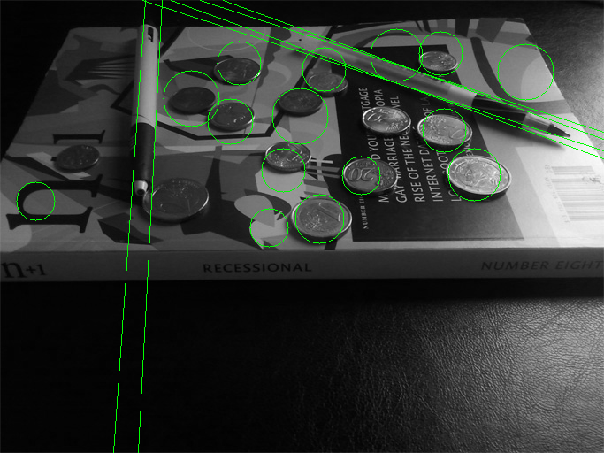

# Problem Set 1 Notes

A quick overview of the algorithms and methods implemented in this exercise.   


## Hough Peaks
```
hough_peaks.py
hough_peaks(H, numpeaks=1, threshold=None, nHoodSize=None):
```
* Any values below the threshold is set to zero upon initialization.
* After the selection of each peak, an n-orthotope (hyperrectangle or n-box) neighbourhood around the peak is set to zero to prevent choosing peaks that are too "similar".
```
hough_peaks.py
mark_hough_peaks(img, peaks_arr, rect_size, copy=True):
```
* Draws a rectangle around each peak of size rect_size in the input image
* Returns a copy of the image by default


## Hough Accumulators
```
hough_lines_acc.py
hough_lines_acc(BW, rho_resolution=1, theta_range=(-90,89), theta_step=1.0):
```
Implementation details
* The range of Rhos go from (-diag, diag+1), where diag is the image diagonal. Between each Rho is a stepsize of rho_resolution 
* Edge points (points lying on the edges of the edge image) are retrived using the numpy.nonzero() method
* The accumulator first loops through each theta
* For each theta, the Rhos of each edge point are accumulated
* These Rhos are then allocated into bins which correspond to the defined range of Rho values using numpy.digitize()
* The binned Rhos then add their individual votes to the overall Hough accumulator 

```
hough_circles_acc.py
hough_circles_acc(BW, radius):
```
Implementation details
* Edge points (points lying on the edges of the edge image) are retrived using the numpy.nonzero() method
* The parameter (a,b) space has the same shape/physical dimensions as the variable (x,y) space, as  
(x - a)^2 + (y - b)^2 = (-(a - x))^2 + (-(b - y))^2 = (a - x)^2 + (b - y)^2
* This interpretation leads to an (x,y) point on a circle in (x,y) space being a circle center in (a,b) space (circle points become centers, centers become circle points)     


## Problem Set Notes


### Q5. Circle Detection    

**Canny Edge Image**        


**Circle Hough Transform (parameter space)**    
Peaks are in boxes      


**Circles Drawn**       


### Q6 & 7. Image With Clutter

**Line Detection**      


**Keeping Only Nearby Parallel Lines**      


```
From Q6(c)
rho_threshold controls the distance between lines (close by)
theta_threshold controls the difference in line angle (parallel)

# Keep parallel lines that are near enough
rho_threshold = 50
theta_threshold = 1

parallel_lines_list = []
for i in range(len(peaks_arr)):
    # Create thresholds for rho and theta
    rho, theta = peaks_arr[i]
    rho_l, rho_u = rho - rho_threshold, rho + rho_threshold
    theta_l, theta_u = theta - theta_threshold, theta + theta_threshold
    for j in range(i +1, len(peaks_arr), 1):
        rho2, theta2 = peaks_arr[j]
        if theta_l <= theta2 and theta2 <= theta_u:   # Within theta tolerance (parallel lines)
            if rho_l <= rho2 and rho2 <= rho_u:   # Outside rho threshold (far away lines)
                parallel_lines_list.append(i)
                parallel_lines_list.append(j)   # Add j index to list

parallel_lines_set = set(parallel_lines_list)
peaks_arr = peaks_arr[np.asarray(tuple(parallel_lines_set))]

```

**Contrast Adjustment**     
Original image had contrast increased by 50% and brightness reduced by 50 to emphasize edges of the objects to be detected.     
Note how the edge of the bottom left coin (near the pen tip) is emphasized against its own shadow 

###### Original Image


###### Contrast Adjusted Image


**Circle Canny Edge Image**     


**"Blob" Removal**      
The high density of edges around the right side of the Canny Edge image will "confuse" the circle detection procedure as the mess of edges easily form a broken circle        
The following steps help remove this "blob" of edges
* A gaussian blur filter was applied onto the Canny Edge image
* The blurred image intensity values are then re-normalized and subtracted from the original Canny Edge image
* The brightest areas are where the "blobs" are
     
       

**Circle Detection After "Blob" Removal**       


### Q8. Distorted Image

The challenge of this image is that the image is distorted (projected) at an angle with respect to the camera.       

Line detection (keeping only nearby parallel lines) and circle detection was applied to the distorted image     
 
Circle detection faced the most problems with the circles being distorted into elipses. As seen from the following image, parts of the coin circumferences barely fit into a circle.           


**Combining Overlapping Circles**

To overcome this problem, overlapping circles were kept and combined while stand-alone circle were removed.     

```
From Q8(c)
Big circles with one or more significantly overlapping smaller circles are combined.
Significantlly overlapping circles is defined to be circles where more than half of the 
  smaller circle radius is witin the bigger circle
The combined circle is generated by averaging the centers and radii of the 
  significantlly overlapping circles 

# Choose only significant overlapping circles
sorted_radii_idx = np.flip(np.argsort(radii_arr), 0)   # Sort circles from largest to smallest (returns sorted index)
len_idx = len(sorted_radii_idx)

new_centres_list, new_radii_list = [], []
for i in range(len_idx):
    if sorted_radii_idx[i] == -1:
        continue

    big_c_idx = sorted_radii_idx[i]
    big_c_rad, big_c_cen = radii_arr[big_c_idx], centers_arr[big_c_idx]

    circle_combine_list = [big_c_idx]
    for j in range(i +1, len_idx, 1):
        small_c_idx = sorted_radii_idx[j]
        small_c_rad, small_c_cen = radii_arr[small_c_idx], centers_arr[small_c_idx]
        centers_dist = np.linalg.norm(np.subtract(big_c_cen, small_c_cen))

        # Check if more than half of the smaller circle is in the bigger circle
        if centers_dist < (big_c_rad - 0.5*small_c_rad):
            circle_combine_list.append(small_c_idx)
            sorted_radii_idx[j] = -1   # Smaller circle will not be checked again

    # Combine overlapping circles by averaging
    if len(circle_combine_list) == 1:
        continue

    # circle_combine_idx_arr = np.asarray(tuple(circle_combine_list))
    circle_combine_idx_arr = np.array(circle_combine_list)
    new_c_rad = int(np.mean(radii_arr[circle_combine_idx_arr]))
    new_c_cen = np.uint16(np.mean(centers_arr[circle_combine_idx_arr], axis=0))

    new_radii_list.append(new_c_rad)
    new_centres_list.append(new_c_cen)

centers_arr, radii_arr = np.array(new_centres_list), np.array(new_radii_list)
```


